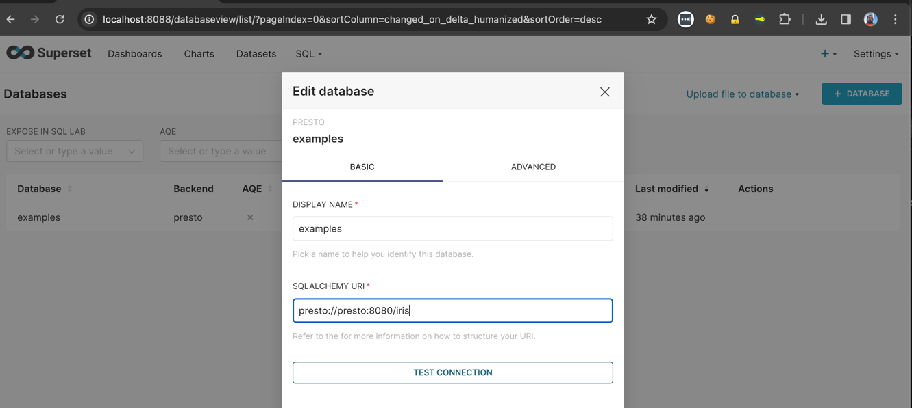
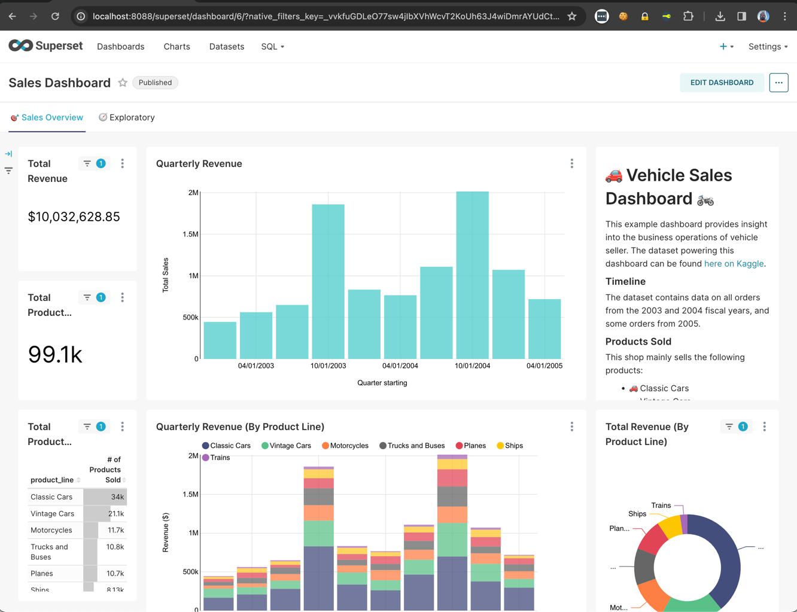
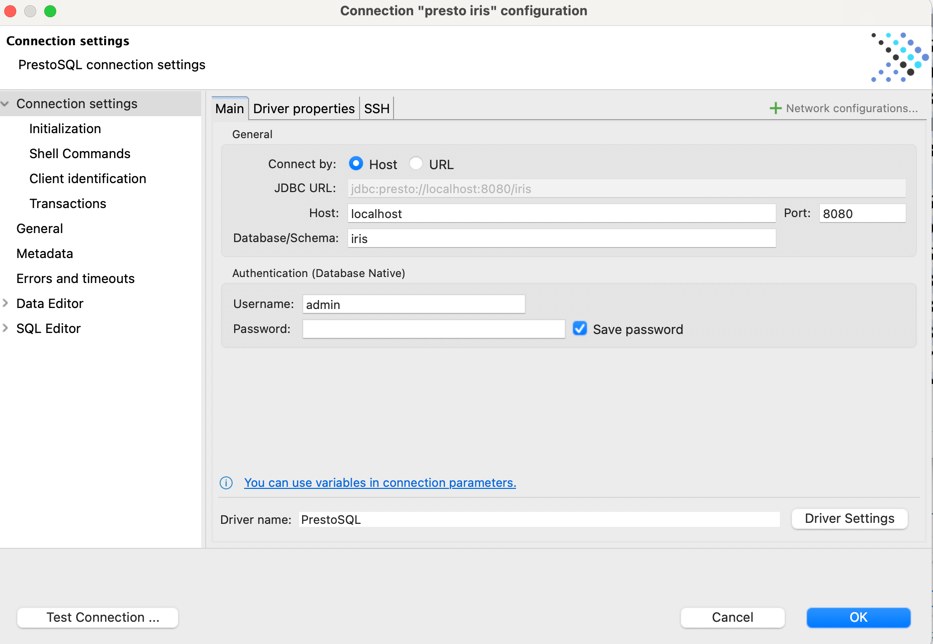
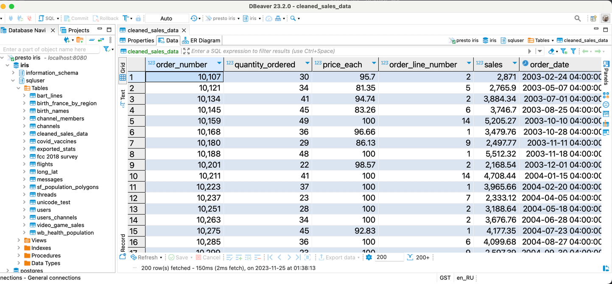

# Presto InterSystems IRIS Connector


[Presto](https://prestodb.io/) is a powerful interactive querying engine that enables running SQL queries on anything -- be it MySQL, HDFS, local file, Kafka -- as long as there exist a connector to the source.

This is Presto connector to the InterSystems IRIS

# Usage

Build from this sources using command, requires Java 11 

```shell
git clone https://github.com/caretdev/presto-iris.git
git clone presto-iris
./mvnw package
```

Or download the [latest release](https://github.com/caretdev/presto-iris/releases) 
file presto-iris-0.1-plugin.tar.gz

Extract it to plugin folder of Presto

Create file named iris.properties in folder etc/catalog of Presto (e.g. /opt/presto-server/etc/catalog/iris.properties)
where the filename is a name for the catalog

```properties
connector.name=iris
connection-url=jdbc:IRIS://iris:1972/USER
connection-user=_SYSTEM
connection-password=SYS
```

# Local Demo

Start the demo environment using docker-compose

```shell
docker-compose up -d --build
```

For the demo purpose, it uses Apache Superset with [superset-iris](https://github.com/caretdev/superset-iris), 
and examples which comes with it, and it takes a while when it will loaded.

Presto UI will be availble on this link http://localhost:8080/ui/#

When SuperSet will finish load examples after 10-15 minutes, it should became available by link http://localhost:8088/databaseview/list
Using admin/admin as username/password



Superset connected to Presto, and catalog iris, which configured to connect to IRIS

Now go to Dashboards



Going to [Presto UI](http://localhost:8080/ui/#) we can see that Presto executed queries, and see some statistics


The same data from IRIS can be observed by using Presto connector in DBeaver




